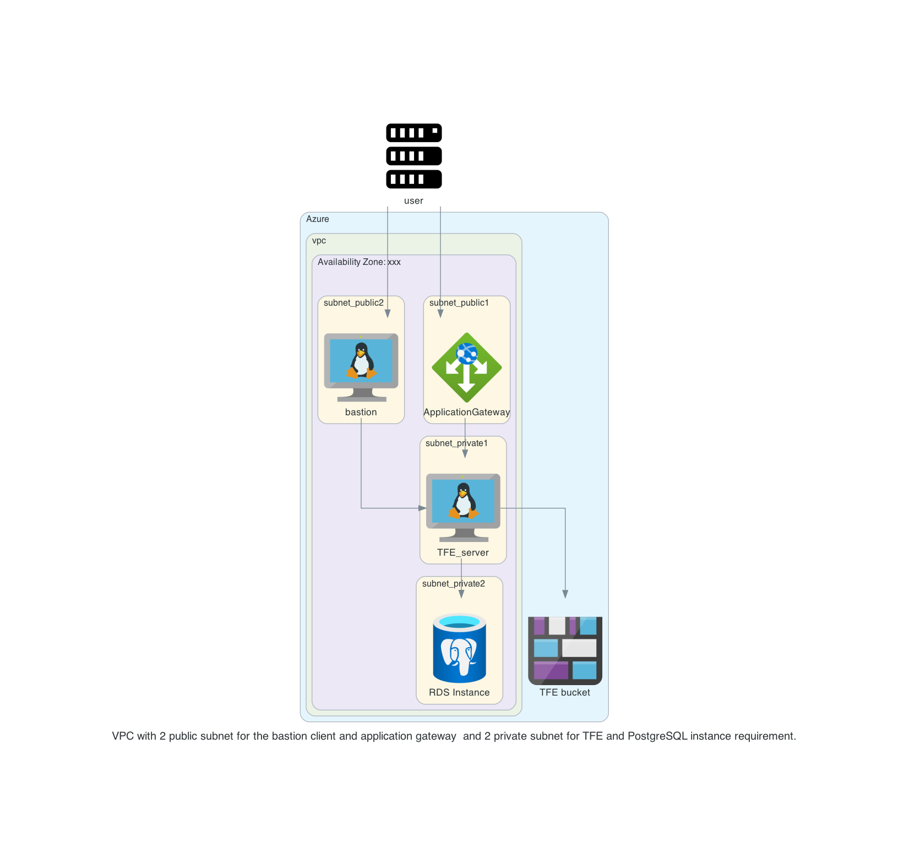

# TFE with SSO

This repository will create a TFE External configuration in Azure with SSO. 


# Diagram

  

# Prerequisites

## License
Make sure you have a TFE license available for use

Store this under the directory `files/license.rli`

## Azure


## Install terraform  
See the following documentation [How to install Terraform](https://learn.hashicorp.com/tutorials/terraform/install-cli)

## TLS certificate
You need to have valid TLS certificates that can be used with the DNS name you will be using to contact the TFE instance.  
  
The repo assumes you have no certificates and want to create them using Let's Encrypt and that your DNS domain is managed under AWS. 


# How to

- Clone the repository to your local machine
```sh
git clone https://github.com/munnep/tfe_aws_agents.git
```
- Go to the directory  
```sh
cd tfe_aws_agents
```
- Set your Azure credentials
```

```

# TODO

- [] build network according to the diagram
- [] use standard ubuntu 
- [] Create an RDS PostgreSQL
- [] create a virtual machine in a public network with public IP address.
    - [] firewall inbound are all from user building external ip
    - [] firewall outbound rules
          postgresql rds
          bucket
          user building external ip
- [] create an elastic IP to attach to the instance
- [] transfer files to TFE virtual machine
      - license
      - [] install TFE
- [] Create a valid certificate to use 
- [] point dns name to public ip address
- [] create an auto scaling group with agents
- [] install TFE

# DONE


